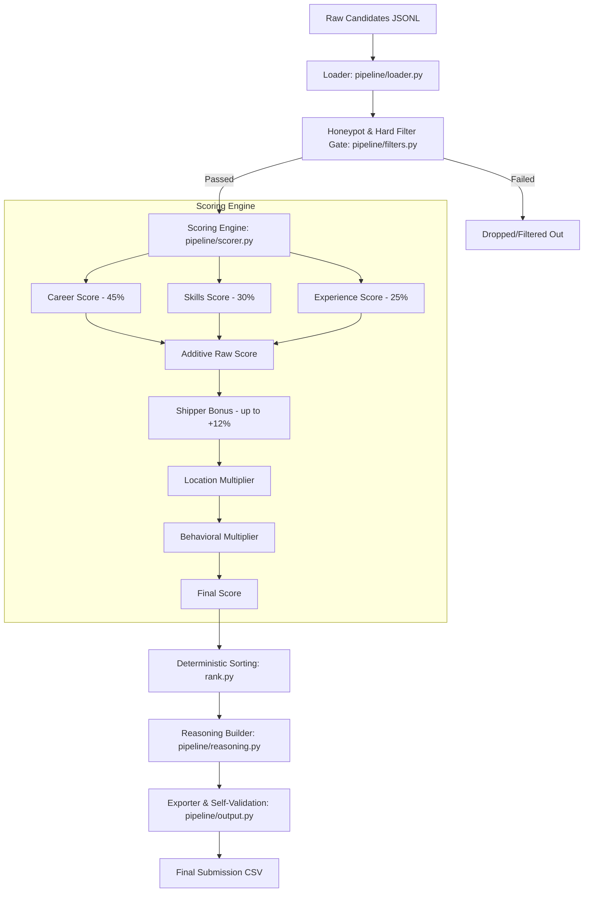

# Redrob Candidate Ranker: Technical Project Documentation

The **Redrob Candidate Ranker** is an automated, multi-dimensional candidate evaluation and ranking system. It is designed to process candidate data, identify and filter out invalid/fraudulent (honeypot) profiles, rank eligible candidates according to specific role requirements, and generate human-readable, fact-based justifications for the ranking.

---

## 1. Project Overview & Goal

In technical recruiting—specifically for highly specialized roles such as Machine Learning, NLP, and Search Engineering—hiring teams are often overwhelmed by a high volume of applications. Within this application pool, recruiters face two primary challenges:
1. **Profile Inflation & Fraud (Honeypots):** Candidates who list expert skills with zero actual experience, mismatch their employment history calendars, or list multiple active full-time roles simultaneously.
2. **Relevance Alignment:** Finding candidates who not only have the right titles but have shipped production models, live in target locations (or are willing to relocate), and exhibit strong behavioral signals (e.g., high responsiveness).

The **Redrob Candidate Ranker** addresses this by executing a multi-stage data pipeline that ingests raw candidate profiles, applies rigorous validation rules, scores them across five distinct dimensions, and outputs the top $N$ candidates with grounded, verifiable reasoning.

---

## 2. Pipeline Architecture

The application is structured as a modular pipeline. Below is the workflow diagram illustrating the candidate's journey through the ranker:



---

## 3. Pipeline Components & Implementation Details

The project is split into five core modules located in the `pipeline/` directory, coordinated by the main entry point `rank.py`.

### A. Main Coordinator (`rank.py`)
- Acts as the main entry point for the ranker.
- Orchestrates loading, scoring, sorting, generating reasoning, writing output, and validation.
- Implements a **deterministic sorting strategy**: candidates are sorted by `score` in descending order, with ties broken using `candidate_id` in ascending order.

### B. Candidate Loader (`pipeline/loader.py`)
- Parses JSON Lines (`.jsonl`) files.
- Provides utility functions to load the entire dataset or take a small sample size for quick debugging.

### C. Honeypot Detector & Hard Filters (`pipeline/filters.py` & `pipeline/scorer.py`)
Before scoring, candidates are evaluated against several consistency checks. If a candidate fails any of the following, they are flagged and excluded from the final rankings:
1. **Impossible Tenure:** Checks if any individual role's duration exceeds the candidate's total years of experience multiplied by a threshold.
2. **Skill Inflation:** Detects candidates claiming multiple `expert` skills while having 0 months of duration and 0 endorsements for those skills.
3. **Education vs. Experience Mismatch:** Ensures the claimed years of experience matches their graduation timeline (e.g., they didn't start working full-time 6+ years before starting college).
4. **Multiple Current Employers:** Filters out candidates holding 3 or more concurrent "current" jobs at different companies.
5. **Expert vs. Assessment Contradiction:** Flags candidates who claim `expert` proficiency in a skill but score extremely low ($< 35/100$) on the corresponding technical assessment.
6. **Location Reachability:** Verifies that international candidates are willing to relocate if they are not based in India.
7. **Purely Non-Technical Filter:** Ensures the candidate has at least one technical role in their career history if their current title is purely non-technical.

### D. Multi-Dimensional Scoring Engine (`pipeline/scorer.py`)
The scoring engine combines additive candidate attributes and applies terminal multipliers:

$$\text{Final Score} = \text{Raw Score} \times (1 + \text{Shipper Bonus}) \times \text{Location Multiplier} \times \text{Behavioral Multiplier}$$

- **Career Score ($45\%$ of raw score):** Iterates through career history to score job titles, company size, and description keyword density (relevancy to embeddings, vector databases, RAG, NLP). Careers consisting entirely of services firms (e.g., TCS, Infosys, Wipro) receive a penalty.
- **Skills Score ($30\%$ of raw score):** Accumulates scores for target skills, weighted by their proficiency levels, durations, endorsements, and actual test assessment scores. Anti-skills (e.g., robotics, computer vision) apply negative weights to filter out non-search/NLP profiles.
- **Experience Score ($25\%$ of raw score):** Gives maximum score ($1.0$) to candidates in the sweet spot of $6\text{--}8$ years of experience, scale-grading downwards for lesser or excessive experience.
- **Shipper Bonus (Up to $+12\%$):** Provides a multiplicative boost if descriptions contain deployment keywords like *"deployed"*, *"launched"*, or *"A/B tested"*.
- **Location Multiplier (Multiplier):**
  - **$1.0$:** Candidate resides in target cities (Pune, Noida, Delhi, Gurugram, Hyderabad, Mumbai, Bengaluru).
  - **$0.78$:** In India, willing to relocate.
  - **$0.50$:** In India, not relocating.
  - **$0.25$:** International, willing to relocate.
  - **$0.05$:** International, not relocating.
- **Behavioral Multiplier (Multiplier):** Evaluates profile recency (days since last active), recruiter response rates, "Open to Work" flags, and interview completion rates to gauge the likelihood of a successful hire.

### E. Factual Reasoning Builder (`pipeline/reasoning.py`)
- Automatically constructs a two-sentence summary justifying the candidate's rank.
- **Strictly Grounded:** All sentences are generated dynamically from the candidate's real profile fields (e.g., current/prior company, skills, exact days active, notice period).
- **Template Safety:** Features a built-in safety check that throws a `ValueError` if any pre-defined template or hallucinated phrase is generated.

### F. CSV Exporter & Validator (`pipeline/output.py`)
- Outputs the finalized ranks to a CSV file containing: `candidate_id`, `rank`, `score`, and `reasoning`.
- **Self-Validation Suite:** Verifies the CSV output formatting, checking for proper headers, exactly 100 rows, unique candidate IDs, sequential ranking, monotonic score decrease, and non-empty reasoning.

---

## 4. Technology Stack & Key Configurations

### Technologies
- **Core Language:** Python 3.x
- **Standard Libraries:** `csv`, `json`, `re`, `argparse`, `time`, `os`, `sys`
- **External Dependencies:**
  - `python-dateutil` (robust date parsing for tenure calculation)
  - `tqdm` (progress bars for command-line feedback)

### Core Configurations (`config.py`)
This file houses all hyperparameters, weights, and keyword lists:
- **Target Experience Range:** Ideal $6\text{--}8$ years, Acceptable $4\text{--}11$ years.
- **Target Locations:** Major Indian tech hubs.
- **Skills Directory:** Positive keywords (e.g., `embeddings`, `rag`, `faiss`) and negative keywords (e.g., `computer vision`, `robotics`).
- **Target Companies & Service Providers:** Identifies services companies to apply appropriate career scoring.

---

## 5. Usage

To run the candidate ranker on a dataset, execute the following command in the terminal:

```bash
python rank.py --candidates <path_to_candidates.jsonl> --out <path_to_output.csv> --top 100
```
